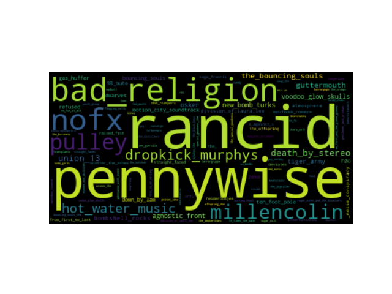

# pyVisualizeMp3Tags

## General
pyVisualizeMp3Tags reads a folder (and all subfolders recursivelly) of mp3 files
and gets mp3 tags to generate:
 * tag cloud of artist names (aggregated)
 * tag cloud of song lyrics (aggregated)

## Requirements and installation
pyVisualizeMp3Tags requires Python 2.7. To install dependencies:

```
pip install -r requirements.txt
```

## Usage
```
python main.py -i punk_collection -o punk.png -s -l
```

(use python main.py -h to see explaination of all command-line arguments)




